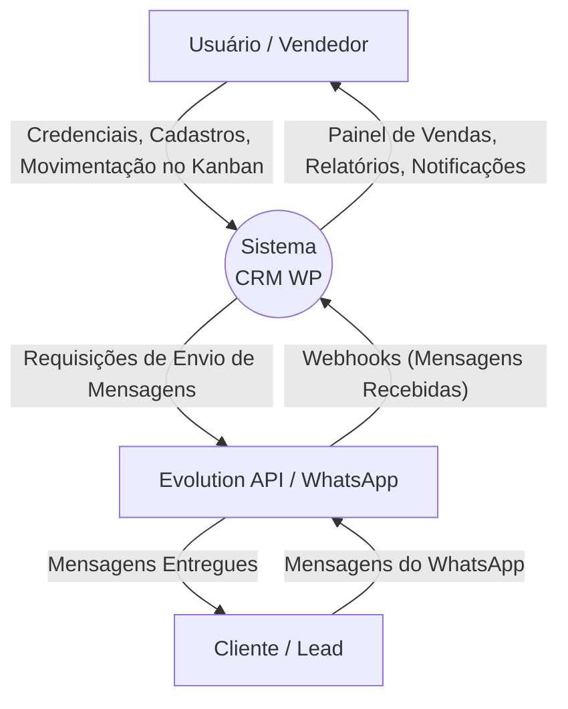
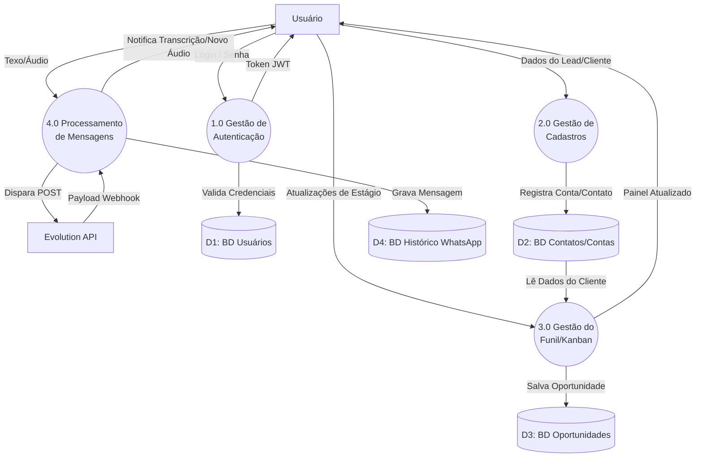
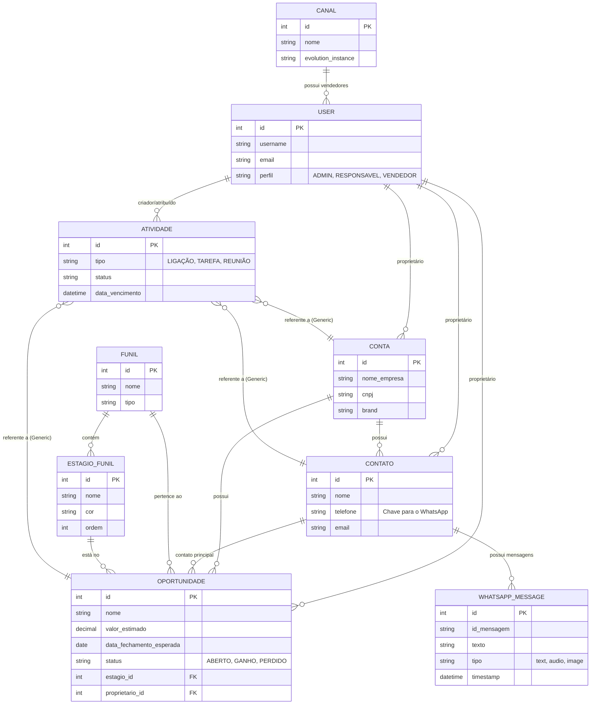
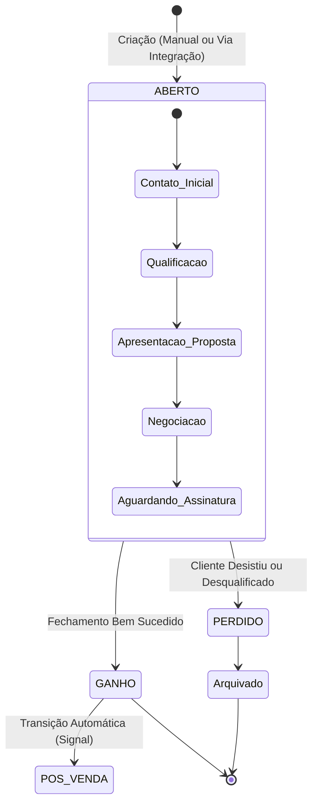
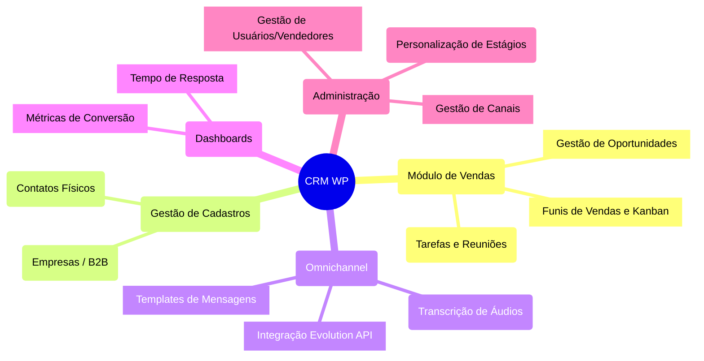
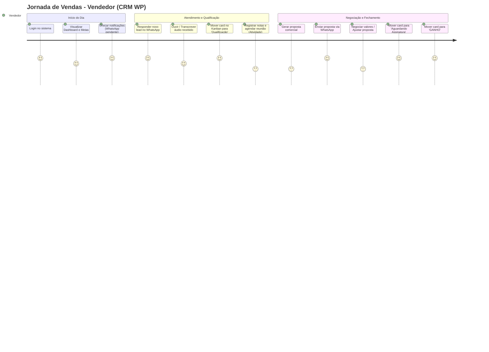

# Diagramas do Sistema - CRM WP

Este documento contém o Diagrama de Fluxo de Dados (DFD) e o Diagrama de Entidade-Relacionamento (ERD) do projeto CRM WP.

## 1. Diagrama de Fluxo de Dados (DFD)

O DFD ilustra como as informações se movem através do sistema, desde as entradas externas até o armazenamento e as saídas.

### DFD Nível 0 (Diagrama de Contexto)
Mostra a visão geral do sistema e suas interações com entidades externas (usuários e integrações).



### DFD Nível 1 (Processos Principais)
Detalhamento dos principais processos internos, fluxos de dados e locais de armazenamento do sistema.



---

## 2. Diagrama de Entidade-Relacionamento (ERD)

O ERD detalha a estrutura do banco de dados relacional e como as entidades do sistema se conectam.



---

## 3. Fluxograma (Business Process / Pipeline de Vendas)

Mapeia as etapas lógicas de um vendedor dentro do sistema, desde a captação até o fechamento.

```mermaid
graph TD
    %% Atores
    V[Vendedor]
    S[Sistema CRM WP]
    
    %% Fluxo
    A[Login no CRM] --> B{Possui Leads \nNovos?}
    B -- Não --> C[Prospecção Ativa / \nAguardar Inbound]
    B -- Sim --> D[Acessar Oportunidade no Kanban]
    
    C --> D
    
    D --> E[Qualificação / \nContato (WhatsApp)]
    E --> F{Lead \nQualificado?}
    F -- Não --> G[Mover para 'Perdido']
    F -- Sim --> H[Levantamento de \nNecessidades / Reunião]
    
    H --> I[Apresentação de \nProposta / Cotação]
    I --> J{Proposta \nAceita?}
    J -- Não --> K[Negociação / \nRevisão da Proposta]
    K --> I
    J -- Sim --> L[Fechamento / \nMover para 'Ganho']
    
    L --> M[Faturamento / \nPassagem para Pós-Venda]
```

---

## 4. Diagrama de Estado (State Diagram)

Demonstra os diferentes status que uma **Oportunidade** pode ter e as transições no ciclo de vida.



---

## 5. Mapa Mental (Mind Map)

Visão macro de toda a arquitetura de módulos e funcionalidades do CRM WP.



---

## 6. Jornada do Usuário (User Journey)

Avalia a experiência e os passos de um **Vendedor** ao usar a aplicação, desde o login até o fechamento, medindo o nível de satisfação/complexidade (1 a 5).


