# Diagrama de Entidade-Relacionamento (ERD) - CRM WP

Este diagrama apresenta a estrutura de dados do backend (Django) do sistema CRM.

```mermaid
erDiagram
    %% Core Entities
    USER ||--o{ CONTA : "proprietário"
    USER ||--o{ CONTATO : "proprietário"
    USER ||--o{ OPORTUNIDADE : "proprietário"
    USER ||--o{ ATIVIDADE : "atribuído_a"
    USER ||--o{ LOG : "usuario"

    CANAL ||--o{ CONTA : "canal"
    CANAL ||--o{ OPORTUNIDADE : "canal"
    
    ORIGEM ||--o{ OPORTUNIDADE : "origem"

    CONTA ||--o{ CONTATO : "vinculado_a"
    CONTA ||--o{ OPORTUNIDADE : "vinculado_a"
    CONTA ||--o{ CONTAMARCA : "possui"
    CONTA ||--o{ DIAGNOSTICO_RESULTADO : "possui"

    CONTATO ||--o{ CONTATO_TELEFONE : "possui"
    CONTATO ||--o{ CONTATO_EMAIL : "possui"
    CONTATO ||--o{ CONTATO_ANEXO : "possui"
    CONTATO ||--o{ CONTATO_REDE_SOCIAL : "possui"
    CONTATO }o--o{ TAG : "etiquetado_com"

    FUNIL ||--o{ FUNIL_ESTAGIO : "configurado_em"
    ESTAGIO_FUNIL ||--o{ FUNIL_ESTAGIO : "pertence_a"
    
    FUNIL ||--o{ OPORTUNIDADE : "fluxo"
    ESTAGIO_FUNIL ||--o{ OPORTUNIDADE : "estágio_atual"

    PLANO ||--o{ OPORTUNIDADE : "plano_selecionado"
    OPORTUNIDADE ||--o{ OPORTUNIDADE_ADICIONAL : "contém"
    PLANO_ADICIONAL ||--o{ OPORTUNIDADE_ADICIONAL : "é_adicional"
    
    OPORTUNIDADE ||--o{ OPORTUNIDADE_ANEXO : "possui"
    OPORTUNIDADE ||--o{ HISTORICO_ESTAGIO : "rastreio"

    %% Generic Relations (simplified for Mermaid)
    ATIVIDADE }o--|| CONTA : "relacionado_a (Generic)"
    ATIVIDADE }o--|| CONTATO : "relacionado_a (Generic)"
    ATIVIDADE }o--|| OPORTUNIDADE : "relacionado_a (Generic)"

    %% Diagnostic System
    DIAGNOSTICO_PILAR ||--o{ DIAGNOSTICO_PERGUNTA : "segmenta"
    DIAGNOSTICO_PERGUNTA ||--o{ DIAGNOSTICO_RESPOSTA : "opções"

    %% Evolution API / WhatsApp
    WHATSAPP_MESSAGE }o--|| CONTATO : "referente_a (via número)"

    %% Entity Definitions with Attributes
    USER {
        string username
        string email
        string first_name
        string last_name
        string perfil "VENDEDOR, RESPONSAVEL, ADMIN"
        string avatar
    }

    CANAL {
        string nome
        string slug
        string evolution_instance
        string evolution_phone_number
    }

    CONTA {
        string nome_empresa
        string cnpj
        string brand "marca"
        string website
    }

    CONTATO {
        string nome
        string email
        string cargo
        string bio
    }

    OPORTUNIDADE {
        string nome
        decimal valor_estimado
        date data_fechamento_estimada
        string status "ABERTO, GANHO, PERDIDO"
    }

    FUNIL {
        string nome
        string tipo "VENDAS, POS_VENDA, SUPORTE"
    }

    ESTAGIO_FUNIL {
        string nome
        string tipo "ABERTO, GANHO, PERDIDO"
        string cor
    }

    ATIVIDADE {
        string titulo
        string tipo "TAREFA, LIGACAO, REUNIAO, EMAIL, NOTA"
        string status "PENDENTE, EM_ANDAMENTO, CONCLUIDO, CANCELADO"
        datetime data_vencimento
    }

    WHATSAPP_MESSAGE {
        string id_mensagem
        string texto
        string tipo "text, audio, image, etc"
        datetime timestamp
    }
```

## Entidades Detalhadas

- **User**: Estende o `AbstractUser` do Django, adicionando perfis de acesso e avatar.
- **Canal**: Define por onde o lead/cliente entra (ex: WhatsApp, Site).
- **Conta**: Representa a organização/empresa cliente.
- **Contato**: Pessoa física vinculada a uma Conta ou Oportunidade.
- **Funil e Estágios**: Estrutura de Kanban customizável para diferentes processos (Vendas, Pós-venda).
- **Oportunidade**: O núcleo do CRM, representando um negócio em potencial.
- **Atividades**: Log de interações e tarefas agendadas.
- **Diagnóstico**: Sistema de avaliação estratégica com pilares e pontuações.
- **WhatsappMessage**: Integração com a Evolution API para histórico de conversas.
